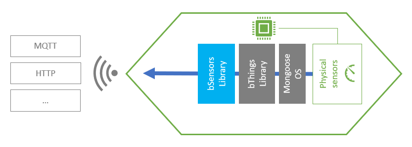
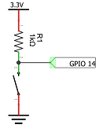

# bSensors Library
## Overview
A *bSensor* offers a common set of APIs for managing any kind of physical sensor. This allows your firmware interacting with sensors without take care of their hardware caratteristics.


## Features
- **Universal value-types** - You can read any sensor value within the supported [bVariant](https://github.com/diy365-mgos/bvar) data-types.
<!-- - **GPIO as sensors** - You can easily manage GPIO as sensors. Just include the [bThings GPIO library](https://github.com/diy365-mgos/bthing-gpio) in your project. -->
## Get Started
Include the library in your `mos.yml` file.
```yaml
libs:
  - origin: https://github.com/diy365-mgos/bsensor
```
**C/C++ firmware samples** - Copy and paste one of the following examples in your `main.c` project file.

Example #1 - Create a *bSensor* for reading the system uptime.
```c
#include "mgos.h"
#include "mgos_bsensor.h"

static bool sensor_get_state_cb(mgos_bthing_t thing, mgos_bvar_t state, void *userdata) {
  mgos_bvar_set_decimal(state, mgos_uptime());
  return true;
}

static void sensor_state_published_cb(int ev, void *ev_data, void *userdata) {
  mgos_bsensor_t sens = (mgos_bsensor_t)ev_data;
  mgos_bthing_t thing = MGOS_BSENSOR_THINGCAST(sens);
  mgos_bvarc_t state = mgos_bthing_get_state(thing);

  LOG(LL_INFO, ("Sensor '%s' state changed: %f.",
    mgos_bthing_get_id(thing), mgos_bvar_get_decimal(state)));
}

enum mgos_app_init_result mgos_app_init(void) {

  mgos_event_add_handler(MGOS_EV_BTHING_PUBLISHING_STATE, sensor_state_published_cb, NULL);

  /* create the sensor */
  mgos_bsensor_t s = mgos_bsensor_create("sens1", MGOS_BTHING_PUB_STATE_MODE_CHANGED);
  /* set the get-state handler */
  mgos_bthing_on_get_state(MGOS_BSENSOR_THINGCAST(s), sensor_get_state_cb, NULL);
  /* set sensor read polling every 2 secs. */
  mgos_bsensor_polling_set(s, 2000);
  
  return MGOS_APP_INIT_SUCCESS;
}
```
Example #2 - Create a *bSensor* for reading a *pressed/released* button state. Before running the code sample, you must wire your boardas indicated in the schema below. 


```c
#include "mgos.h"
#include "mgos_bsensor.h"

static int gpio_pin = 14;

static bool sensor_get_state_cb(mgos_bthing_t thing, mgos_bvar_t state, void *userdata) {
  mgos_bvar_set_bool(state, mgos_gpio_read(gpio_pin));
  return true;
}

static void sensor_state_published_cb(int ev, void *ev_data, void *userdata) {
  mgos_bsensor_t sens = (mgos_bsensor_t)ev_data;
  mgos_bthing_t thing = MGOS_BSENSOR_THINGCAST(sens);
  mgos_bvarc_t state = mgos_bthing_get_state(thing);

  LOG(LL_INFO, ("The button '%s' (on GPIO %d) has been %s.",
    mgos_bthing_get_id(thing), gpio_pin, (mgos_bvar_get_bool(state) ? "RELEASED" : "PUSHED")));
}

enum mgos_app_init_result mgos_app_init(void) {

  mgos_event_add_handler(MGOS_EV_BTHING_PUBLISHING_STATE, sensor_state_published_cb, NULL);

  /* create the sensor */
  mgos_bsensor_t s = mgos_bsensor_create("btn1", MGOS_BTHING_PUB_STATE_MODE_CHANGED);
  /* set the get-state handler */
  mgos_bthing_on_get_state(MGOS_BSENSOR_THINGCAST(s), sensor_get_state_cb, NULL);
  /* set sensor read polling every 2 secs. */
  mgos_bsensor_interrupt_set(s, gpio_pin, MGOS_GPIO_PULL_UP, MGOS_GPIO_INT_EDGE_ANY, 50);
  
  return MGOS_APP_INIT_SUCCESS;
}
```
[!] Tips&Tricks: use the [bThings GPIO library](https://github.com/diy365-mgos/bthing-gpio) for making the firmware above more simple and lightweight.
## C/C++ APIs Reference
### Inherited *bThing* APIs
A *bSensor* inherits [bThing](https://github.com/diy365-mgos/bthing) APIs.
- [mgos_bthing_get_id()](https://github.com/diy365-mgos/bthing#mgos_bthing_get_id)
- [mgos_bthing_on_get_state()](https://github.com/diy365-mgos/bthing#mgos_bthing_on_get_state)
- [mgos_bthing_get_state()](https://github.com/diy365-mgos/bthing#mgos_bthing_get_state)
- [mgos_bthing_on_updating_state()](https://github.com/diy365-mgos/bthing#mgos_bthing_on_updating_state)
- All other [bThings Core library](https://github.com/diy365-mgos/bthing) APIs...
  
### MGOS_BSENSOR_THINGCAST
```c
mgos_bthing_t MGOS_BSENSOR_THINGCAST(mgos_bsensor_t sensor);
```
Casts a *bSensor* to a generic *bThing* to be used with [inherited bThing APIs](#inherited-bthing-apis).

|Parameter||
|--|--|
|sensor|A *bSensor*.|

Example:
```c
mgos_bsensor_t sensor = mgos_bsensor_create(...);
printf("Sensor %s successfully created", mgos_bthing_get_id(MGOS_BSENSOR_THINGCAST(sensor)));
```
### mgos_bsensor_create
```c
mgos_bsensor_t mgos_bsensor_create(const char *id, enum mgos_bthing_notify_state notify_state);
```
Creates a *bSensor*. Returns `NULL` on error.

|Parameter||
|--|--|
|id|The *bSensor* ID.|
|notify_state|The [notify-state mode](https://github.com/diy365-mgos/bthing#enum-mgos_bthing_notify_state).|
### mgos_bsensor_polling_set
```c
bool mgos_bsensor_polling_set(mgos_bsensor_t sensor, int poll_ticks);
```
Activates the polling mode for updating a *bSensor* state. It cannot be activated if the *bSensor* is in interrupt mode (see `mgos_bsensor_interrupt_set()` below). Returns `true` on success, or `false` otherwise.

|Parameter||
|--|--|
|sensor|A *bSensor*.|
|poll_ticks|The polling interval, in milliseconds.|
### mgos_bsensor_interrupt_set
```c
bool mgos_bsensor_interrupt_set(mgos_bsensor_t sensor, int pin,
                                enum mgos_gpio_pull_type pull_type,
                                enum mgos_gpio_int_mode int_mode,
                                int debounce);
```
Activates the interrupt mode for updating a *bSensor* state when an interrupt is triggered. It cannot be activated if the *bSensor* is in polling mode (see `mgos_bsensor_polling_set()` above). Returns `true` on success, or `false` otherwise.

|Parameter||
|--|--|
|sensor|A *bSensor*.|
|pin|The GPIO pin triggering the interrupt.|
|pull_type|The GPIO [pull type](https://mongoose-os.com/docs/mongoose-os/api/core/mgos_gpio.h.md#mgos_gpio_set_pull). One of the `MGOS_GPIO_PULL_*` values.|
|int_mode|The interrupt mode. One of the `MGOS_GPIO_INT_EDGE_*` values (see [mgos_gpio_set_int_handler()](https://mongoose-os.com/docs/mongoose-os/api/core/mgos_gpio.h.md#mgos_gpio_set_int_handler) for more details).|
|debounce|Debouncing time or `0` to disable it. Typically 50 ms of debouncing time is sufficient.|
## To Do
- Implement javascript APIs for [Mongoose OS MJS](https://github.com/mongoose-os-libs/mjs).