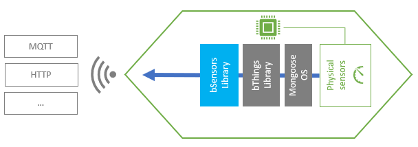

# bSensors Library
## Overview
A bSensor offers a common set of APIs for managing any kind of physical sensor. This allows your firmware interacting with sensors without take care of their hardware caratteristics.


## Features
- **Universal value-types** - You can read any sensor value within the supported [bVariant](https://github.com/diy365-mgos/bvar) data-types.
- **GPIO as sensors** - You can easily manage GPIO as sensors. Just include the [bThings GPIO library](https://github.com/diy365-mgos/bthing-gpio) in your project.
## Get Started in C/C++
Include the library in your `mos.yml` file.
```yaml
libs:
  - origin: https://github.com/diy365-mgos/bsensor
```
#### Example 1 - System uptime sensor
Create a bSensor for reading the system uptime.
```c
#include "mgos.h"
#include "mgos_bsensor.h"

static bool sensor_get_state_cb(mgos_bthing_t thing, mgos_bvar_t state, void *userdata) {
  mgos_bvar_set_decimal(state, mgos_uptime());
  return true;
}

static void sensor_state_published_cb(int ev, void *ev_data, void *userdata) {
  mgos_bthing_t thing = MGOS_BSENSOR_THINGCAST((mgos_bsensor_t)ev_data);

  LOG(LL_INFO, ("Sensor '%s' state changed: %f.",
    mgos_bthing_get_id(thing), mgos_bvar_get_decimal(mgos_bthing_get_state(thing))));
}

enum mgos_app_init_result mgos_app_init(void) {
  mgos_event_add_handler(MGOS_EV_BTHING_PUBLISHING_STATE, sensor_state_published_cb, NULL);

  /* create the sensor */
  mgos_bsensor_t s = mgos_bsensor_create("sens1", MGOS_BTHING_PUB_STATE_MODE_CHANGED);
  /* set the get-state handler */
  mgos_bthing_on_get_state(MGOS_BSENSOR_THINGCAST(s), sensor_get_state_cb, NULL);
  /* set sensor read polling every 2 secs. */
  mgos_bsensor_polling_set(s, 2000);
  
  return MGOS_APP_INIT_SUCCESS;
}
```
#### Example 2 - Push button
Create a bSensor for reading a *pressed/released* button state (see a [similar example](https://github.com/diy365-mgos/bbinsensor#example-1---push-button) using [bBinarySensors](https://github.com/diy365-mgos/bbinsensor)). Before running the code sample, you must wire your boardas indicated in the schema below. 


In addition, include this library in your mos.yml file.
```yaml
libs:
  - origin: https://github.com/diy365-mgos/bthing-gpio
```
```c
#include "mgos.h"
#include "mgos_bsensor.h"
#include "mgos_bthing_gpio.h"

static int gpio_pin = 14;

static void sensor_state_published_cb(int ev, void *ev_data, void *userdata) {
  mgos_bthing_t thing = MGOS_BSENSOR_THINGCAST((mgos_bsensor_t)ev_data);

  LOG(LL_INFO, ("The button '%s' (on GPIO %d) has been %s.",
    mgos_bthing_get_id(thing), gpio_pin,
    (mgos_bvar_get_bool(mgos_bthing_get_state(thing)) ? "PUSHED" : "RELEASED")));
}

enum mgos_app_init_result mgos_app_init(void) {
  mgos_event_add_handler(MGOS_EV_BTHING_PUBLISHING_STATE, sensor_state_published_cb, NULL);

  /* create the sensor */
  mgos_bsensor_t s = mgos_bsensor_create("btn1", MGOS_BTHING_PUB_STATE_MODE_CHANGED);
  /* set sensor read polling every 2 secs. */
  mgos_bsensor_interrupt_set(s, gpio_pin, MGOS_GPIO_PULL_UP, MGOS_GPIO_INT_EDGE_ANY, 50);
  /* attach GPIO  */
  mgos_bthing_gpio_attach(MGOS_BSENSOR_THINGCAST(s), gpio_pin, false, false);
  
  return MGOS_APP_INIT_SUCCESS;
}
```
## C/C++ APIs Reference
### Inherited bThing APIs
A bSensor inherits [bThing](https://github.com/diy365-mgos/bthing) APIs.
- [mgos_bthing_get_id()](https://github.com/diy365-mgos/bthing#mgos_bthing_get_id)
- [mgos_bthing_on_get_state()](https://github.com/diy365-mgos/bthing#mgos_bthing_on_get_state)
- [mgos_bthing_get_state()](https://github.com/diy365-mgos/bthing#mgos_bthing_get_state)
- [mgos_bthing_on_updating_state()](https://github.com/diy365-mgos/bthing#mgos_bthing_on_updating_state)
- All other [bThings core library](https://github.com/diy365-mgos/bthing) APIs...
### MGOS_BSENSOR_TYPE
```c
#define MGOS_BSENSOR_TYPE 4 
```
The bSensor type ID returned by [mgos_bthing_get_type()](https://github.com/diy365-mgos/bthing#mgos_bthing_get_type). It can be used with [mgos_bthing_is_typeof()](https://github.com/diy365-mgos/bthing#mgos_bthing_is_typeof).

Example:
```c
if (mgos_bthing_is_typeof(MGOS_BSENSOR_TYPE)) LOG(LL_INFO, ("I'm a bSensor."));
if (mgos_bthing_is_typeof(MGOS_BTHING_TYPE_SENSOR)) LOG(LL_INFO, ("I'm a bThing sensor."));
```
Output console:
```shell
I'm a bSensor.
I'm a bThing sensor.
```
### MGOS_BSENSOR_THINGCAST
```c
mgos_bthing_t MGOS_BSENSOR_THINGCAST(mgos_bsensor_t sensor);
```
Casts a bSensor to a generic bThing to be used with [inherited bThing APIs](#inherited-bthing-apis).

|Parameter||
|--|--|
|sensor|A bSensor.|

Example:
```c
mgos_bsensor_t sensor = mgos_bsensor_create(...);
printf("Sensor %s successfully created", mgos_bthing_get_id(MGOS_BSENSOR_THINGCAST(sensor)));
```
### mgos_bsensor_create
```c
mgos_bsensor_t mgos_bsensor_create(const char *id, enum mgos_bthing_pub_state_mode pub_state_mode);
```
Creates a bSensor. Returns `NULL` on error.

|Parameter||
|--|--|
|id|The bSensor ID.|
|pub_state_mode|The [publish-state mode](https://github.com/diy365-mgos/bthing#enum-mgos_bthing_pub_state_mode).|
### mgos_bsensor_polling_set
```c
bool mgos_bsensor_polling_set(mgos_bsensor_t sensor, int poll_ticks);
```
Activates the polling mode for updating a bSensor state. It cannot be activated if the bSensor is in interrupt mode (see `mgos_bsensor_interrupt_set()` below). Returns `true` on success, or `false` otherwise.

|Parameter||
|--|--|
|sensor|A bSensor.|
|poll_ticks|The polling interval, in milliseconds.|
### mgos_bsensor_interrupt_set
```c
bool mgos_bsensor_interrupt_set(mgos_bsensor_t sensor, int pin,
                                enum mgos_gpio_pull_type pull_type,
                                enum mgos_gpio_int_mode int_mode,
                                int debounce);
```
Activates the interrupt mode for updating a bSensor state when an interrupt is triggered. It cannot be activated if the bSensor is in polling mode (see `mgos_bsensor_polling_set()` above). Returns `true` on success, or `false` otherwise.

|Parameter||
|--|--|
|sensor|A bSensor.|
|pin|The GPIO pin triggering the interrupt.|
|pull_type|The GPIO [pull type](https://mongoose-os.com/docs/mongoose-os/api/core/mgos_gpio.h.md#mgos_gpio_set_pull). One of the `MGOS_GPIO_PULL_*` values.|
|int_mode|The interrupt mode. One of the `MGOS_GPIO_INT_EDGE_*` values (see [mgos_gpio_set_int_handler()](https://mongoose-os.com/docs/mongoose-os/api/core/mgos_gpio.h.md#mgos_gpio_set_int_handler) for more details).|
|debounce|Debouncing time or `0` to disable it. Typically 50 ms of debouncing time is sufficient.|
## To Do
- Implement javascript APIs for [Mongoose OS MJS](https://github.com/mongoose-os-libs/mjs).